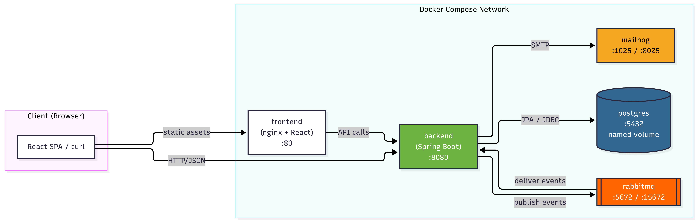

# Marketplace

A full-stack online marketplace where **shoppers** buy products, **sellers**
run stores, and **admins** govern the platform. Built with Spring Boot 3.3,
PostgreSQL 16, RabbitMQ 3.13, and React 18 with TypeScript. The entire stack
runs in Docker — no local Java, Maven, Node, or Postgres installation
required.

**Live deployment:**
- Frontend: https://marketplace-web-bkt.fly.dev
- Backend API: https://marketplace-api-bkt.fly.dev
- Swagger UI: https://marketplace-api-bkt.fly.dev/swagger-ui.html

[](#)
[](#)
[](#)
[](#)
[](#)
[](#)
[](#license)

---

## Table of Contents

- [Quick Start](#quick-start)
- [Demo Accounts](#demo-accounts)
- [Service URLs](#service-urls)
- [Architecture](#architecture)
- [Entity Relationships](#entity-relationships)
- [Order Flow](#order-flow)
- [Features Implemented](#features-implemented)
- [API Documentation](#api-documentation)
- [Tech Stack](#tech-stack)
- [Testing](#testing)
- [Environment Variables](#environment-variables)
- [Deployment](#deployment)
- [Known Limitations](#known-limitations)
- [Security Notes](#security-notes)
- [Project Structure](#project-structure)
- [Troubleshooting](#troubleshooting)
- [License](#license)

---

## Quick Start

### Prerequisites

The only thing you need installed is **Docker** (with the Compose plugin).
No Java, Node.js, PostgreSQL, RabbitMQ, or any other runtime required. The
entire stack — backend, frontend, database, message broker, and email
server — runs inside Docker containers.

- **Docker Desktop** (macOS / Windows): https://www.docker.com/products/docker-desktop
- **Docker Engine + Compose plugin** (Linux): https://docs.docker.com/engine/install/

Verify with:

```bash
docker --version           # 24.x or newer
docker compose version     # v2.20 or newer
```

### One-Command Setup

```bash
# 1. Clone the repository
git clone https://github.com/benjaminketteytagoe-alu/awesomity-online-marketplace.git
cd awesomity-online-marketplace

# 2. Copy the example environment file
cp .env.example .env

# 3. Start the entire stack
docker compose up -d --build
```

The first startup takes 3 to 5 minutes. Subsequent startups take under a
minute because Docker layers are cached.

### Verify the Stack Is Up

```bash
docker compose ps
```

Expected: five containers running.

| Container | Status |
|---|---|
| `marketplace-postgres` | `Up (healthy)` |
| `marketplace-rabbitmq` | `Up (healthy)` |
| `marketplace-mailhog` | `Up` |
| `marketplace-backend` | `Up (healthy)` |
| `marketplace-frontend` | `Up` |

Open **http://localhost:3000** to see the app.

### What Docker Compose Brings Up

Five services, in dependency order:

| Service | Purpose | Host port |
|---|---|---|
| postgres | Persistent database | none (internal) |
| rabbitmq | Async job queue | none (internal) |
| mailhog | Development email capture | none (internal) |
| backend | Spring Boot API | 8080 |
| frontend | nginx serving React SPA | 3000 |

The `docker-compose.override.yml` file exposes extra host ports for
`postgres` (5433), `rabbitmq` (5672 + 15672), and `mailhog` (1025 + 8025)
so they can be inspected during development. The base `docker-compose.yml`
is production-shaped — only the two application ports are exposed.

### Stopping and Rebuilding

```bash
# Stop containers, keep data
docker compose down

# Stop containers, delete all data (reseeds on next up)
docker compose down -v

# Rebuild both services
docker compose up -d --build

# Rebuild only one
docker compose up -d --build backend
docker compose up -d --build frontend
```

---

## Demo Accounts

> **Demo environment.**
> The credentials below are intentionally public so reviewers can test
> admin, seller, and shopper flows without requesting access. This is
> **not a production environment** — no real user data is stored, the
> admin password is shared openly, and destructive admin actions affect
> only the demo dataset.
>
> To reset: `fly apps destroy marketplace-postgres-bkt && cd infra &&
> fly deploy --config fly.postgres.toml`, then redeploy the backend.

The demo data seeder creates these accounts on first startup. All are
verified and ACTIVE.

| Role | Email | Password | What to try |
|---|---|---|---|
| **Admin** | `admin@marketplace.local` | `Admin-Marketplace-2026` | Review seller applications, manage users / products / orders / categories, feature products |
| **Seller** | `carol@example.com` | `Seller123` | Manage Carol Crafts' products, advance order status |
| **Seller** | `nordic@example.com` | `Seller123` | Manage Nordic Home's products |
| **Shopper** | `benjamin@example.com` | `Shopper123` | Browse, cart, checkout, pay, review, view orders |

The admin password comes from the `ADMIN_PASSWORD` environment variable in
`.env`. The seeder enforces a 12-character minimum.

---

## Service URLs

When the stack is running locally:

| Service | URL | Purpose |
|---|---|---|
| **Frontend** | http://localhost:3000 | React SPA — start here |
| **Backend API** | http://localhost:8080 | Direct API access |
| **Swagger UI** | http://localhost:8080/swagger-ui.html | Interactive API docs (OpenAPI 3) |
| **Mailhog** | http://localhost:8025 | All dev emails land here |
| **RabbitMQ Management** | http://localhost:15672 | Queue inspection (`marketplace` / `marketplace`) |
| **PostgreSQL** | `localhost:5433` | DB access (`marketplace` / `marketplace`) |

Postgres is exposed on `:5433` (not `:5432`) to avoid conflicts with any
local Postgres install on the host machine.

---

## Architecture



The system is a five-service Docker Compose stack:

| Service | Role |
|---|---|
| **frontend** | nginx serving the built React SPA. Proxies `/api/*` to the backend and handles the SPA fallback (`try_files $uri /index.html`). The backend URL is injected at container start via an envsubst template. |
| **backend** | Spring Boot REST API on port 8080. Handles all business logic, JWT authentication, and orchestrates async work. |
| **postgres** | Primary datastore. Normalized schema with Flyway migrations. |
| **rabbitmq** | Message broker. Carries email jobs and domain events (e.g. `OrderPlaced`). |
| **mailhog** | SMTP server and web UI. Catches all outgoing email during development so nothing is sent to real addresses. |

Only `frontend` (port 3000) and `backend` (port 8080) are exposed publicly.
Postgres, RabbitMQ, and Mailhog are internal to the Docker network.

### Request Flow

1. The browser loads the SPA from **nginx** (port 3000).
2. The SPA makes API calls to `/api/*`, which nginx proxies to **backend** (port 8080).
3. The backend reads and writes **Postgres** via JPA/Hibernate.
4. For async work, the backend publishes to **RabbitMQ**.
5. Consumers subscribe and perform the work — sending via **Mailhog** SMTP, decrementing stock, updating order status.

The HTTP request path never talks to SMTP or RabbitMQ directly. All
outbound side effects go through the **transactional outbox** pattern: a
database row is written in the same transaction as the business change,
then a poller publishes the message. This prevents the "order saved but
email never sent" failure mode.

---

## Entity Relationships


Core tables:

- **`users`** — all roles (ADMIN, SHOPPER, SELLER) in one table with a `role` column. Soft-deleted via `deleted_at`.
- **`stores`** — one per seller (`owner_id` is UNIQUE). Cascades products on delete.
- **`categories`** — flat list, referenced by products. Cannot be deleted if any product references them.
- **`products`** — belong to a store and a category. Soft-deleted.
- **`orders`** — belong to a shopper. `status` is a Postgres enum (PENDING to PAID to PROCESSING to SHIPPED to DELIVERED, plus CANCELLED).
- **`order_items`** — line items. Store a **price snapshot** (`unit_price`) so historical orders do not change when a seller updates the price. `subtotal` is a generated column.
- **`payments`** — one order may have many payment attempts. Records success and failure with a `reference`.
- **`reviews`** — one per (user, product) pair, enforced by a UNIQUE constraint. Reviews require a qualifying purchase.
- **`seller_applications`** — the invite flow. An admin approves an application, which generates a one-time `invite_token`; the applicant accepts the invite to become a SELLER with a store.

Every table has `created_at` and `updated_at` timestamps maintained by a
database trigger.

---

## Order Flow


The order lifecycle has two user-facing steps and one async step.

**Step 1 — Create order** (`POST /api/orders`).
Order is created with `status=PENDING`. Stock is not decremented yet. No
emails are sent yet. The user gets back `{ orderId, status, totalAmount }`.

**Step 2 — Pay** (`POST /api/orders/{id}/pay`).
The mock PSP (`MockPaymentGateway`) validates the card or mobile money
details.

- Card: Luhn-valid, unexpired, CVV present. Numbers ending in `0000` always decline.
- Mobile money: phone matches a regex, provider is MTN or Airtel. Phones ending in `0000` always decline.

On success, the backend writes a `payments` row with `status=SUCCESS`,
publishes an `OrderPlaced` event to RabbitMQ, and returns immediately.

**Step 3 — Async processing** (RabbitMQ consumer).
An `OrderProcessingConsumer` picks up the event. It:

1. Decrements stock atomically (`WHERE stock >= qty`).
2. Sets order `status=PAID`.
3. Publishes an `OrderStatusEmail` event.

An `EmailConsumer` sends confirmation emails to both shopper and seller.

If stock is insufficient at this stage, the consumer rolls back any partial
decrements and marks the order `CANCELLED`.

**Step 4 — Track** (`GET /api/orders/{id}`).
The frontend polls the order endpoint after payment to observe the
transition from `PENDING` to `PAID`.

---

## Features Implemented

### Authentication and Authorization

- Email and password registration with verification email on signup.
- Email verification required before login.
- JWT authentication with short-lived access tokens and refresh tokens. Silent refresh on 401 via axios interceptor.
- Three roles enforced at the API level: ADMIN, SHOPPER, SELLER.
- Self-service profile page: edit display name, change password.

### Shopper Flow

- Browse the public product catalog with search, category filter, and sort.
- Product detail page with stock indicator and reviews.
- Cart persisted to localStorage — survives refresh.
- Checkout with mock payment: card or mobile money.
- Order history with status tracker.
- Cancel an order while it is `PENDING` or `PAID` (restores stock for PAID).
- Reviews and ratings — only after purchase, one review per product per user.

### Seller Flow

- Apply to be a seller via a public form.
- Receive an invite email when an admin approves the application.
- Set password via a one-time link — creates a SELLER account and store.
- View own store.
- CRUD on own products — create, edit, delete (soft).
- View and advance orders containing own products — PAID to PROCESSING to SHIPPED to DELIVERED, enforced by a state machine.

### Admin Flow

- Review seller applications — approve (sends invite email) or reject (with reason).
- Manage all users — change role, suspend or reactivate. Enforces `SELF_SUSPEND` and `HAS_STORE` business rules.
- Manage all stores — view, delete (cascades to products).
- Manage all products — feature or unfeature, delete.
- Manage all orders — filter by status, force any status.
- Manage categories — create, edit, delete (only if unused).

### Payments (Mock)

- Card: Luhn-valid, expiry check, CVV required. Test card `4242 4242 4242 4242` succeeds. Any number ending in `0000` declines.
- Mobile money: MTN or Airtel. Test phone `+250791234567` succeeds. Numbers ending in `0000` decline.

### Async Processing (RabbitMQ)

- Transactional outbox pattern — no dual-write failures.
- Order processing — async stock decrement and status transition.
- Email dispatch — verification, invites, order confirmations, status updates, all queued and retried.
- Dead-letter support configured in `RabbitConfig`.

### Email Notifications

All emails go to **Mailhog** in dev. Templates:

- Email verification (registration)
- Seller application received
- Seller invite (after approval)
- Seller rejection (with reason)
- Order confirmation (shopper and seller)
- Order status change (shopper)

---

## API Documentation

**Swagger UI** is available at:

- Local: http://localhost:8080/swagger-ui.html
- Deployed: https://marketplace-api-bkt.fly.dev/swagger-ui.html

Every endpoint is documented with OpenAPI 3 annotations. Key groups:

| Group | Prefix | Auth |
|---|---|---|
| Auth | `/api/auth/*` | Public |
| Users (self) | `/api/users/me` | Any authenticated |
| Products | `/api/products` | Public (write: SELLER) |
| Categories | `/api/categories` | Public |
| Orders | `/api/orders` | SHOPPER |
| Reviews | `/api/products/{id}/reviews` | Public (write: SHOPPER) |
| Seller | `/api/seller/*` | SELLER |
| Admin | `/api/admin/*` | ADMIN |
| Payments | `/api/orders/{id}/pay` | SHOPPER |
| Seller applications | `/api/seller-applications` | Public (accept requires token) |

To get a token:

```bash
curl -s -X POST http://localhost:8080/api/auth/login \
  -H "Content-Type: application/json" \
  -d '{"email":"benjamin@example.com","password":"Shopper123"}' \
  | jq -r '.accessToken'
```

---

## Tech Stack

### Backend

| Layer | Choice | Why |
|---|---|---|
| Language | Java 21 (LTS) | Records, pattern matching, virtual threads |
| Framework | Spring Boot 3.3 | Mature ecosystem, dependency injection, security, validation |
| Build | Maven | Explicit, well understood, wrapper included |
| Database | PostgreSQL 16 | Relational fits the marketplace model |
| ORM | Spring Data JPA and Hibernate | Standard, productive |
| Migrations | Flyway | Versioned SQL, reviewable, deterministic |
| Auth | Spring Security and JWT (jjwt) | Stateless, standard |
| Validation | Jakarta Bean Validation | Declarative constraints on DTOs |
| Email | Spring Mail and Thymeleaf | HTML templates with variables |
| Message broker | RabbitMQ | Task queues with retry and dead-letter |
| Docs | springdoc-openapi | Swagger UI from annotations |
| Testing | JUnit 5, Testcontainers, MockMvc | Real Postgres in tests |

### Frontend

| Layer | Choice | Why |
|---|---|---|
| Language | TypeScript | Type safety across the API boundary |
| Framework | React 18 and Vite | Fast dev server, minimal config |
| Routing | React Router v6 | Standard, declarative |
| Server state | TanStack Query v5 | Caching, retries, mutations with proper invalidation |
| Client state | Zustand | Minimal, for auth and cart |
| HTTP | Axios | Interceptors for silent JWT refresh |
| Forms | React Hook Form and Zod | Performant, schema-driven validation |
| Styling | Tailwind CSS | Utility-first, consistent design tokens |

### Infrastructure

| Layer | Choice |
|---|---|
| Containerization | Docker and Docker Compose |
| Frontend serving | nginx (SPA fallback and API proxy via envsubst template) |
| Dev email | Mailhog |
| Deployment | Fly.io (five apps: frontend, backend, Postgres, RabbitMQ, Mailhog) |

---

## Testing

### Backend tests

```bash
# Inside the running backend container
docker compose exec backend ./mvnw test

# Or locally (requires Java 21 and Maven on the host)
cd backend
./mvnw test
```

The test suite uses **Testcontainers** to spin up a real Postgres for
integration tests. No H2 dialect mismatches.

### Frontend checks

```bash
cd frontend

# Type check — must pass with zero errors
npm run typecheck

# Lint — must pass with zero warnings
npm run lint

# Build — verifies the production bundle compiles
npm run build
```

### End-to-end smoke test

A manual smoke test verifies the whole system:

1. As shopper (`benjamin@example.com`): browse `/products`, add to cart, check out with test card `4242 4242 4242 4242`, verify order appears in `/orders`.
2. Check Mailhog at http://localhost:8025: confirmation email arrives.
3. As seller (`carol@example.com`): see the order in `/seller/orders`, advance status PAID to PROCESSING to SHIPPED to DELIVERED.
4. As shopper: verify the order status updates in `/orders/{id}`.
5. As admin (`admin@marketplace.local`): see the order in `/admin/orders`, force its status via the dropdown.

---

## Environment Variables

All variables live in `.env`. Copy `.env.example` to `.env` before starting.

| Variable | Default | Purpose |
|---|---|---|
| `POSTGRES_DB` | `marketplace` | Database name |
| `POSTGRES_USER` | `marketplace` | DB user |
| `POSTGRES_PASSWORD` | `marketplace` | DB password |
| `RABBITMQ_USER` | `marketplace` | RabbitMQ user |
| `RABBITMQ_PASSWORD` | `marketplace` | RabbitMQ password |
| `JWT_SECRET` | (dev default) | HS512 signing key — rotate for production |
| `JWT_ACCESS_TTL_MINUTES` | `15` | Access token lifetime |
| `JWT_REFRESH_TTL_DAYS` | `7` | Refresh token lifetime |
| `APP_BASE_URL` | `http://localhost:8080` | Backend URL |
| `FRONTEND_BASE_URL` | `http://localhost:3000` | Frontend URL (used in email links) |
| `MAIL_FROM` | `no-reply@marketplace.local` | From address for outgoing mail |
| `ADMIN_EMAIL` | `admin@marketplace.local` | Seeded admin email |
| `ADMIN_PASSWORD` | `Admin-Marketplace-2026` | Seeded admin password — 12 char minimum |

For production, replace `JWT_SECRET` and `ADMIN_PASSWORD` with strong
random values. Never commit `.env` — it is in `.gitignore`.

---

## Deployment

**Live URLs:**

- Frontend: https://marketplace-web-bkt.fly.dev
- Backend API: https://marketplace-api-bkt.fly.dev
- Swagger UI: https://marketplace-api-bkt.fly.dev/swagger-ui.html

**Admin credentials:**

- Email: `admin@marketplace.local`
- Password: `Admin-Marketplace-2026`

The deployment runs on **Fly.io** as five apps in the same organization:

| App | Role |
|---|---|
| `marketplace-web-bkt` | Frontend (nginx and React), public HTTPS |
| `marketplace-api-bkt` | Backend (Spring Boot), public HTTPS |
| `marketplace-postgres-bkt` | Self-hosted Postgres 16 with persistent volume |
| `marketplace-rabbit-bkt` | Self-hosted RabbitMQ with persistent volume |
| `marketplace-mailhog-bkt` | Mailhog (internal SMTP) |

All apps connect over Fly's private WireGuard network. Only the frontend
and backend have public addresses. Postgres and RabbitMQ persist data on
Fly volumes.

The deployment configs live in:

- `infra/fly.postgres.toml`
- `infra/fly.rabbit.toml`
- `infra/fly.mailhog.toml`
- `backend/fly.toml`
- `frontend/fly.toml`

To redeploy any service:

```bash
cd backend && fly deploy        # or frontend, infra/*.toml
```

---

## Known Limitations

Deliberately out of scope for this submission — noted honestly rather than
hidden:

- **Email change is not supported.** The backend has no self-service endpoint. Changing email would require a re-verification flow.
- **No password reset flow.** Forgot-password requires email and token infrastructure not implemented here.
- **No profile photo or avatar upload.** Identity is initials-on-gradient.
- **No OAuth or social login.** Email and password only.
- **Reviews are text-only.** No photos, no seller responses.
- **Admin products view has client-side search only.** The public product endpoint does not accept search params.
- **No push notifications.** Order updates via email only.
- **Single-region, single-node.** No horizontal scaling tested.
- **No rate limiting.** Would add via a filter in production.

---

## Security Notes

### CVE-2026-53669 — React Router open redirect

Affects `react-router-dom` versions 6.0.0 through 7.17.0. A crafted path
containing backslashes can cause `<Link>` or `useNavigate` to navigate to
an external origin, enabling phishing and token-exfiltration attacks.

**Status: mitigated at the application layer.**

All dynamic navigation targets are validated with `safeInternalPath()`
(`frontend/src/lib/navigation.ts`). This function rejects anything that is
not a clean internal path — including paths containing backslashes, paths
starting with `//`, and paths with a scheme prefix. It is applied at:

- `RequireRole.tsx` — the `redirectTo` prop
- `auth.mutations.ts` — the `useLogin` return-to-origin path

Library upgrade to `react-router-dom@7.18.0+` is planned as a dedicated
migration step.

### GHSA-337j-9hxr-rhxg — SSR constructor injection

**Status: not applicable.**

This advisory only affects React Router Framework Mode and Data Mode
applications performing SSR and hydration. This project uses Declarative
Mode routing (`<BrowserRouter>` and `<Routes>` and `<Route element>`).

### Additional hardening in place

- JWT signing key must be rotated for production.
- Admin password must be at least 12 characters and rotated for production.
- HTTPS is expected at the ingress in production.
- No secrets committed. `.env` is gitignored.
- Authentication is JWT-based, not cookie-based — no CSRF risk.

### Deferred (documented in SECURITY.md)

- Login rate limiting and account lockout
- Content Security Policy headers
- Password reset flow
- Google OAuth
- Second-factor authentication
- Dependency vulnerability scanning in CI

See `SECURITY.md` for the full list.

---

## Project Structure

```
marketplace/
├── docker-compose.yml             # 5-service stack (production-shaped)
├── docker-compose.override.yml    # Dev-only port exposures
├── .env.example                   # Environment template
├── .gitignore
├── README.md
├── SECURITY.md
├── docs/
│   ├── system-design.png
│   ├── er-diagram.png
│   └── order-flow.png
│
├── backend/
│   ├── Dockerfile
│   ├── fly.toml
│   ├── pom.xml
│   └── src/main/
│       ├── java/com/marketplace/
│       │   ├── MarketplaceApplication.java
│       │   ├── admin/
│       │   ├── auth/
│       │   ├── bootstrap/
│       │   ├── category/
│       │   ├── common/
│       │   ├── config/
│       │   ├── messaging/
│       │   ├── order/
│       │   ├── payment/
│       │   ├── product/
│       │   ├── review/
│       │   ├── security/
│       │   ├── seller/
│       │   ├── store/
│       │   └── user/
│       └── resources/
│           ├── application.yml
│           ├── db/migration/
│           └── templates/email/
│
├── frontend/
│   ├── Dockerfile
│   ├── fly.toml
│   ├── nginx.conf
│   ├── package.json
│   └── src/
│       ├── app/
│       ├── components/
│       │   ├── layout/
│       │   └── ui/
│       ├── features/
│       │   ├── admin/
│       │   ├── auth/
│       │   ├── cart/
│       │   ├── categories/
│       │   ├── checkout/
│       │   ├── orders/
│       │   ├── products/
│       │   ├── profile/
│       │   ├── reviews/
│       │   └── seller/
│       ├── lib/
│       │   ├── api/
│       │   ├── query/
│       │   ├── navigation.ts
│       │   └── storage.ts
│       └── pages/
│
└── infra/
    ├── fly.postgres.toml
    ├── fly.rabbit.toml
    └── fly.mailhog.toml
```

---

## Troubleshooting

### Port already in use

Ports `3000`, `8080`, `5433`, `5672`, `15672`, `1025`, `8025` are exposed
to the host. If any conflict with another service, edit
`docker-compose.override.yml` to map to a different host port.

### Frontend serves a stale build

If you changed frontend code and it does not appear:

```bash
docker compose up -d --build frontend
```

The container serves the built SPA. Rebuild to pick up changes.

### Database seems empty

If `docker compose down -v` was run, all data is gone. On the next
`docker compose up`, the `DemoDataSeeder` will reseed. Verify:

```bash
docker compose logs backend | grep "DEMO DATA SEEDED"
```

### Emails are not arriving

Check Mailhog at http://localhost:8025. If empty, check backend logs:

```bash
docker compose logs backend | grep -i email
```

### Postgres on a different port than expected

The host port is `5433` (mapped from the container's `5432`) to avoid
conflicts. Connect with:

```bash
psql -h localhost -p 5433 -U marketplace -d marketplace
```

Or via Docker:

```bash
docker compose exec postgres psql -U marketplace -d marketplace
```

### Full reset

```bash
docker compose down -v
docker compose up -d --build
```

This wipes volumes, rebuilds containers, and reseeds on startup.

---

## MIT License
